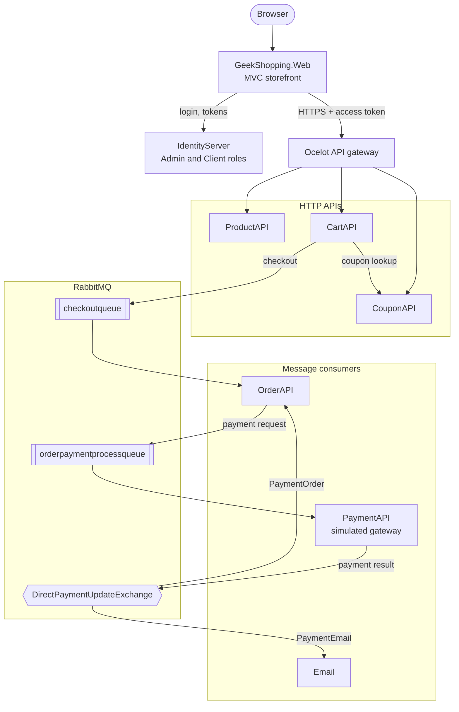
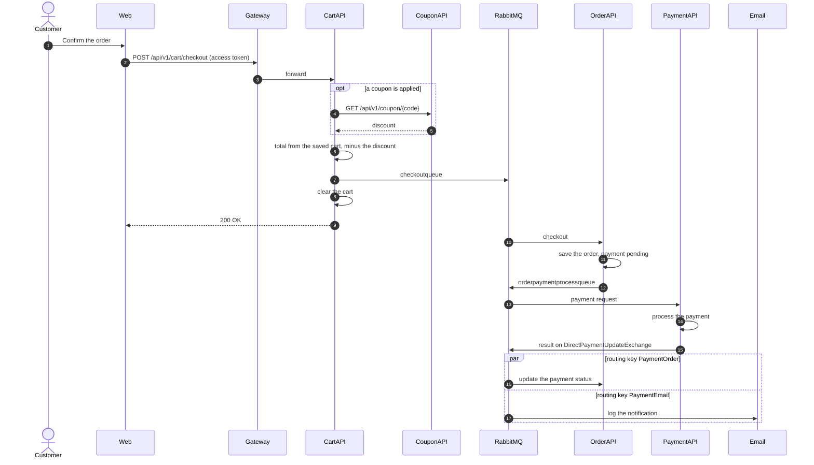

# GeekShopping

[](https://github.com/joaogqueiroz/GeekShopping/actions/workflows/ci.yml)

An e-commerce platform built as .NET microservices. Each service owns its own database, the front end talks to the APIs through an Ocelot gateway, authentication is handled by Duende IdentityServer, and checkout, payment and notifications run asynchronously over RabbitMQ.

## Architecture



The storefront logs people in through IdentityServer and calls the HTTP APIs through the gateway with the access token. Checkout, payment and the order status run over RabbitMQ.

## Services

| Service | Port | What it does |
| --- | --- | --- |
| `GeekShopping.Web` | 4430 | ASP.NET Core MVC storefront |
| `GeekShopping.IdentityServer` | 4435 | Login and tokens (Duende IdentityServer + ASP.NET Identity), `Admin` and `Client` roles |
| `GeekShopping.ApiGateway` | 4480 | Ocelot gateway that routes product, cart and coupon calls |
| `GeekShopping.ProductAPI` | 4440 | Product catalogue |
| `GeekShopping.CartAPI` | 4445 | Cart, coupons on the cart, checkout |
| `GeekShopping.CouponAPI` | 4450 | Coupon lookup |
| `GeekShopping.OrderAPI` | 4455 | Creates orders from checkouts and tracks payment status |
| `GeekShopping.PaymentAPI` | 7087 | Processes payments and publishes the result |
| `GeekShopping.Email` | 4460 | Records a notification when an order is paid |
| `GeekShopping.MessageBus` | – | Shared base message types |
| `GeekShopping.PaymentProcessor` | – | Simulated payment gateway (class library) |

Each API has its own SQL Server database (`geek_shopping_product`, `geek_shopping_cart`, `geek_shopping_order`…), managed with EF Core migrations.

## Checkout flow



1. **CartAPI** publishes the checkout to `checkoutqueue`.
2. **OrderAPI** saves the order and requests payment on `orderpaymentprocessqueue`.
3. **PaymentAPI** processes it and publishes the result to a direct exchange.
4. The exchange routes the result to **OrderAPI**, which updates the order status, and to **Email**, which logs the notification.

## Tech stack

C# · .NET 8 · ASP.NET Core Web API and MVC · Ocelot · Duende IdentityServer · ASP.NET Identity · Entity Framework Core · SQL Server · RabbitMQ · AutoMapper · Swagger · Docker Compose

## Running locally

Requirements: .NET 8 SDK (`global.json` requires 8.0.100 or a later 8.0 SDK) and Docker.

```sh
# SQL Server on 1433 and RabbitMQ on 5672 (management UI at http://localhost:15672)
docker compose up -d
```

Each service that uses RabbitMQ reads the connection from the `RabbitMQ` section of its `appsettings.json`.

Apply the migrations for each service that has a database, for example:

```sh
dotnet ef database update --project GeekShopping.ProductAPI
```

Then start the services. The simplest way is to open `GeekShopping.sln` in Visual Studio and set multiple startup projects: IdentityServer, ApiGateway, the APIs, Email and Web. Open the storefront at https://localhost:4430.

## Tests

`GeekShopping.Tests` has a folder per service. Repository tests run against SQL Server 2022 started by [Testcontainers](https://dotnet.testcontainers.org/), and each test class gets its own database built with that service's real EF Core migrations, so the only requirement is a running Docker.

```sh
dotnet test
```

`GeekShopping.ApiTests` starts the real APIs in memory with `WebApplicationFactory`, against SQL Server from Testcontainers. Tokens are signed with a test key instead of coming from IdentityServer, but the JwtBearer validation and the `ApiScope` policy are the real ones; the coupon API and RabbitMQ are replaced by fakes that record what was sent. They check that the cart API requires a token with the `geek_shopping` scope (401/403), that nobody can read or change someone else's cart (403), wrong JSON (400), and a whole purchase over HTTP: the order published to `checkoutqueue` carries the amount computed on the server, not the one the client sent. For the product API they check the public listing, 401/403/404, wrong JSON and the field limits (price of at least 1, names and texts no longer than their columns). Creating and updating products only require a signed-in user, not an Admin; a test documents that choice.

They check the AutoMapper configuration of every API, the cart repository (adding items, adding the same product again, coupons, removing items, clearing the cart), the purchase amount (price × quantity, discounts, exact decimals, invalid quantities and prices), checkout (the amount comes from the saved cart and never from the request, coupon validation, empty carts, publishing the order to RabbitMQ and clearing the cart, with the dependencies mocked) the product catalogue (seeded products, create, update and delete), and the order API: the order built from a checkout (item count, items, the payment request) and the order repository. For the Web app they check the total shown on the cart page.
